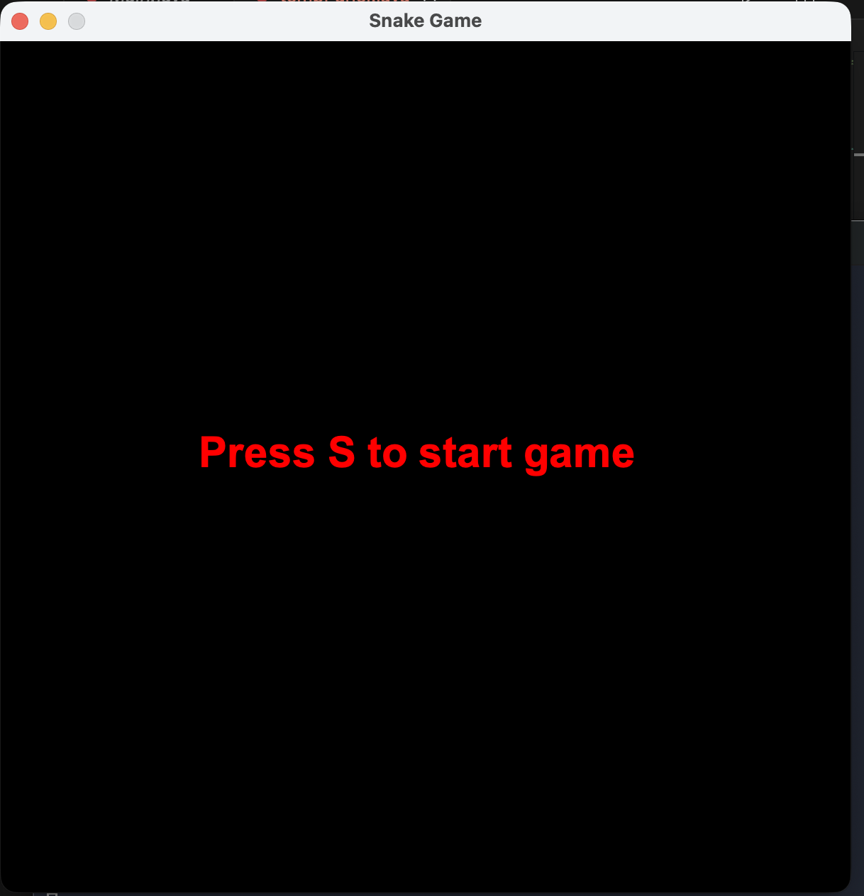
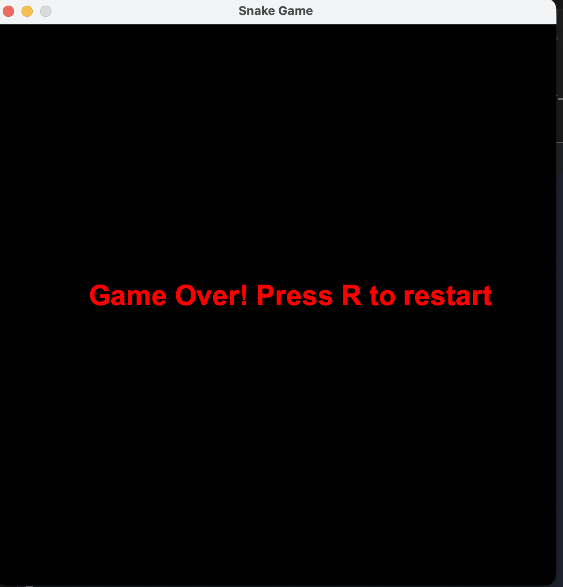
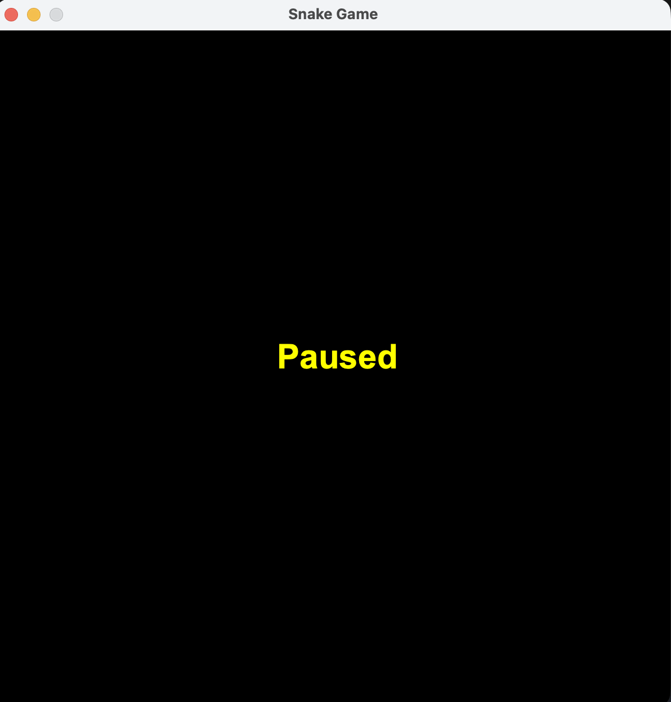

[Back to Portfolio](./)

Project 1: Snake Game 
===============

-   **Class: CSCI 325
-   **Grade: 100/100
-   **Language(s): Java
-   **Source Code Repository:** [features/mastering-markdown](https://guides.github.com/features/mastering-markdown/)  
    (Please [email me](mailto:example@csustudent.net?subject=GitHub%20Access) to request access.)

## Project description

This project we made the classic poular game Snake Game using Java. We used terminal to run it. The game is basically making sure the snake doesnt die by crashing in to a wall or itself. It also grows whenever it eats the apple. The key features include snake movement via keyboard input, score tracking, detection when the snake dies and the game is over. 

## How to compile and run the program

How to compile (if applicable) and run the project.

```bash
cd ./project
python setup.py
```

If the programming language does not require compilation, the update the heading to be “How to run the program.” If your application is deployed on a remote service, including instructions on how to deploy it.

## UI Design

This is a terminal game and the user plays the game using the keyboard. The UI consists of game grid, score board, apple and the snake as well as a message telling the user if the game is paused, over or instruction to start the game. 

  
Fig 1. The launch screen press S to start the game

  
Fig 2. Can be layed using the keyboard right, left, up and down.

  
Fig 3. Can restart the game by clicking R.

  
Fig 4. If the user press space the game is paused and also starts.

## 3. Additional Considerations

The game is a one player game but it can be imporved by adding a timer, comparing previous score to new score, and adding multiple players. 

For more details see [GitHub Flavored Markdown](https://guides.github.com/features/mastering-markdown/).

[Back to Portfolio](./)
