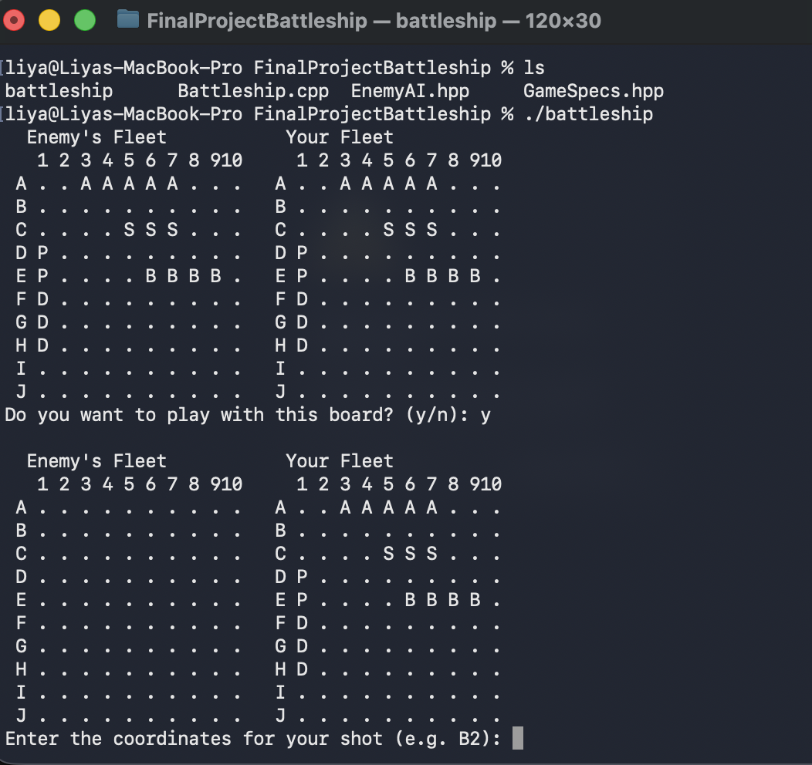
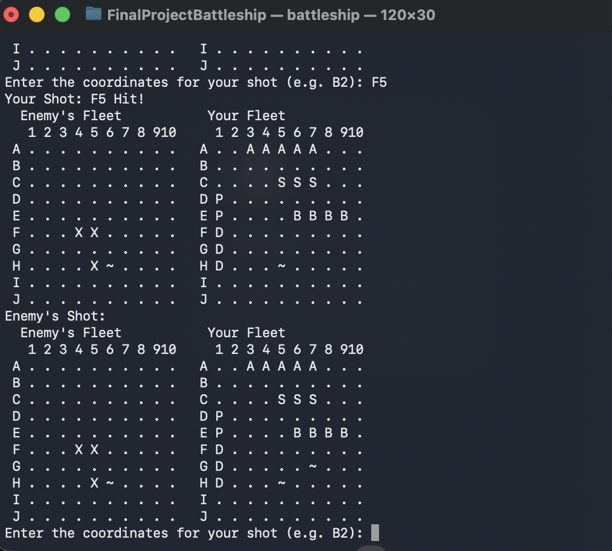
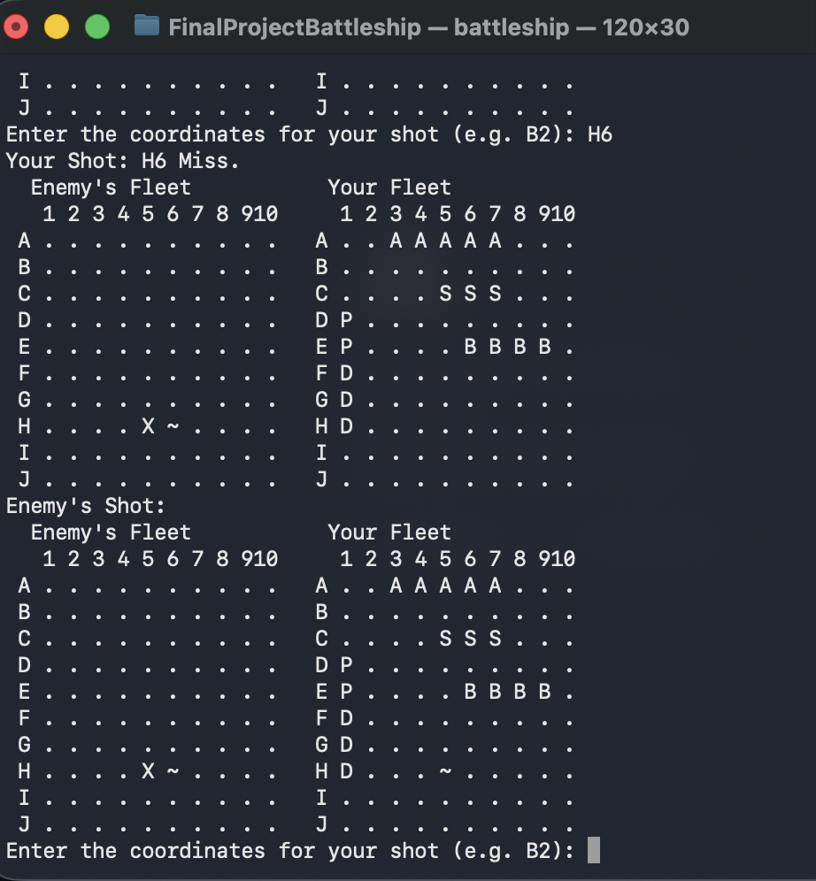

[Back to Portfolio](./)

Project 3: Battleship Game
===============

-   Class: CSCI 235
-   Grade: 71/100
-   Language(s): C++
-   Source Code Repository:** [[features/mastering-markdown](https://guides.github.com/features/mastering-markdown/)  ](https://github.com/Liya-Bes/BattleshipGame)
    (Please [email me](mailto:example@csustudent.net?subject=GitHub%20Access) to request access.)

## Project description

Using C++ we recreated the Battleship game. The player is going to be playing against the AI controlled enemy. The game is locating and destroying the enemy's ship before they destroy your ship. We used procedural programming principles and C++ fundementals.   

## How to compile and run the program

How to compile (if applicable) and run the project.

```bash
# Compile the program
g++ Battleship.cpp -o battleship

# Run the program
./battleship
```

## UI Design

We used terminal to run the game. The user inputs what coordinates they would like to attack and get either hit or miss text depending if they hit or miss. They would also be able to view what places they have succesfully hit and what they have missed by updating the game board after each play. 

The figures below will show the game board, the instruction, and what message is displayed when user miss, hit, and enter invalid coordinates.

  
Fig 1. The launch Game and ask if they would like to play

  
Fig 2. If the coordinates theu picked hit the enemy ship.

  
Fig 3. If they missed the ship.

  
Fig 4. If they enter invalid coordinate.

## 3. Additional Considerations

We used an AI, EnemyAI.hpp to attack the players board.

For more details see [GitHub Flavored Markdown](https://guides.github.com/features/mastering-markdown/).

[Back to Portfolio](./)
