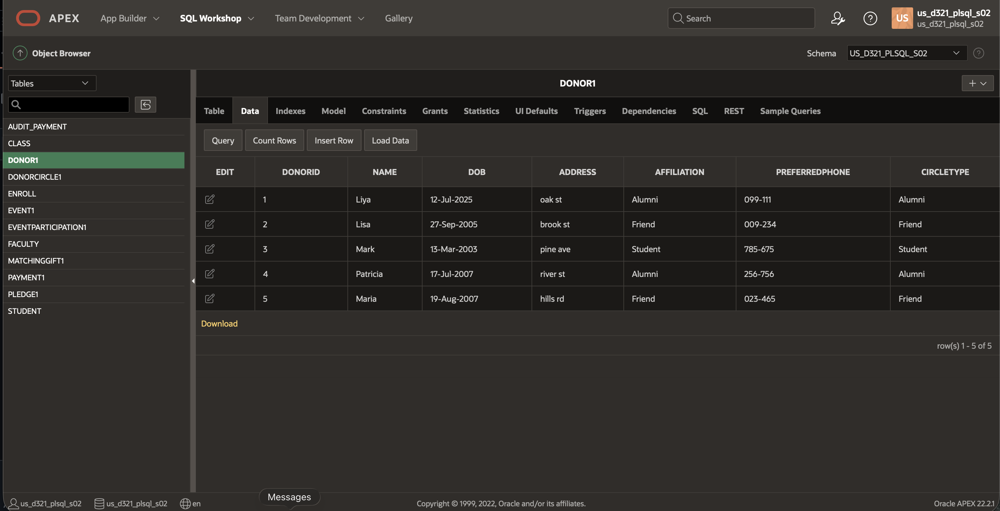
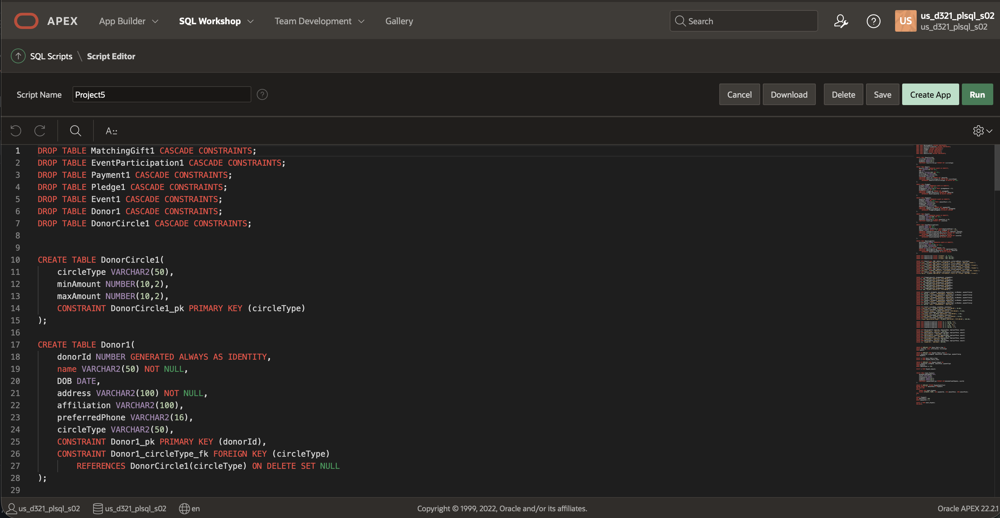
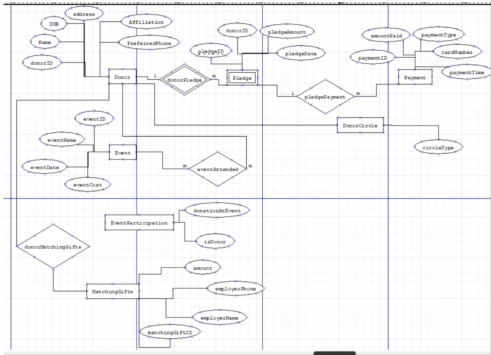

[Back to Portfolio](./)

Project 1 Donor Management Database Design & Implementation
===============

-   **Class: CSCI 419
-   **Grade: This is a semester project with different parts. I found the average grade for this whole project to be                       97.14/100. 
-   **Language(s): Oracle SQL, SQL, EER and ER Diagrams
-   **Source Code Repository: N/A

## Project description

For this project, I designed a complete relational database system for university donor management using Oracle SQL. The system models donors profiling, pledge tracking, payments, events, donor circles, matching gifts and event participation. The project was a semester long project and had several parts (planning -> design -> mapping -> implementation -> normalization -> security. Projects parts are listed below please click to view the project file. 
1. [Part 1 - Introduction and Requirements](/pdf/Part1.pdf)
2. [Part 2 - Planning, Techinques and Data Dictionary](/pdf/Part2.pdf)
3. [Part 3 - ER and EER Diagram](/pdf/Part3.pdf)
4. [Part 4 - Mapping ER & EER Diagram](/pdf/Part4.pdf)
5. [Part 5 - Implementation: SQL statements & Sample Date](/pdf/Part5.pdf)
6. [Part 6 - Normalizing the Relational Model](/pdf/Part6.pdf)
7. [Part 7 - Implementing Security](/pdf/Part7:8.pdf)
8. [Final SQL Script click to download.](/pdf/Project5.sql)

## How to compile and run the program

1. open Oracle SQL Developer
2. Download the file attached above
3. go to file and select Project5.sql
4. run script
5. the tables and everything should start running
6. can run sample quaries if you wish

## UI Design

Users like DBA, analysts and others can perform tasks like creating a schema with one script, viewing data like donors and payment data through public views, updating and reviewing audit trails and testing constraints through sample inserts and deletes. 

  
Fig 1. The sample data in APEX.

  
Fig 2. My SQL Scripts

  
Fig 3. ER Diagram

## 3. Additional Considerations

This project required applying the full database life cycle: requirements analysis, conceptual modeling, enhanced modeling (specialization/generalization), relational mapping, setting constraints (PK, FK, CHECK), normalization up through BCNF, implementing security using views and audit trails.

For more details see [GitHub Flavored Markdown](https://guides.github.com/features/mastering-markdown/).

[Back to Portfolio](./)
