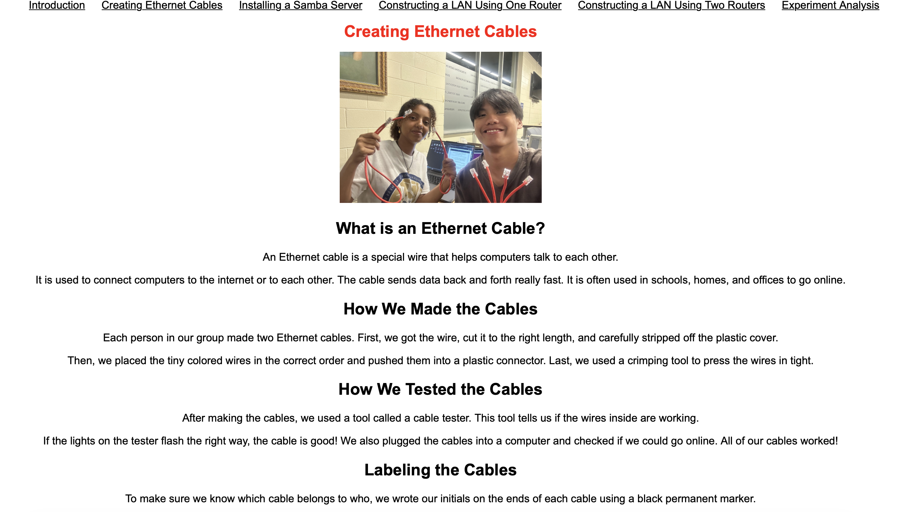

Portfolio
=========

Programming Projects
--------------------

*For access to my private project repositories, please [email me](mailto:lmbesintu@student.csuniv.edu?subject=GitHub%20Access) with the subject line, GitHub Access.

---
### [Project 1 Creating Ethernet Cables & Building a LAN | CSCI 332](project1.md)

---
### [Project 2 Snake Game | CSCI 325](Project2.md)

---
### [Project 3 Battleship Game | CSCI 235](Project3.md)

---
### [Project 4 Title | CSCI 332](Project4.md)

---

Ethics Papers
-------------

### [Paper 1 Important Notification or Disruptive Distraction?](/pdf/EthicsPaper.pdf)

-   **Class: CSCI 235 
-   **Grade: 91/100

### [Paper 2 What I believe will be the most significant ethical dilemma or dilemmas I will face in my career](/pdf/Ethics+Paper-3.pdf)

-   **Class: CSCI 325
-   **Grade: 95/100

### [Paper 3 Software Testing](/pdf/EthicsPaper2.pdf)

-   **Class: CSCI 315
-   **Grade: 100/100

---

Presentations
-------------

### [Presentation 1 Title](/pdf/sample_presentation.pdf)

- **Class:** 
- **Grade:**

### [Presentation 2 Title](/pdf/sample_presentation.pdf)

- **Class:** 
- **Grade:**

---

Page template forked from <a href="https://github.com/csu-cs/csci-portfolio">CSU-CS</a>

<!-- Remove above link if you don't want to attributive -->
